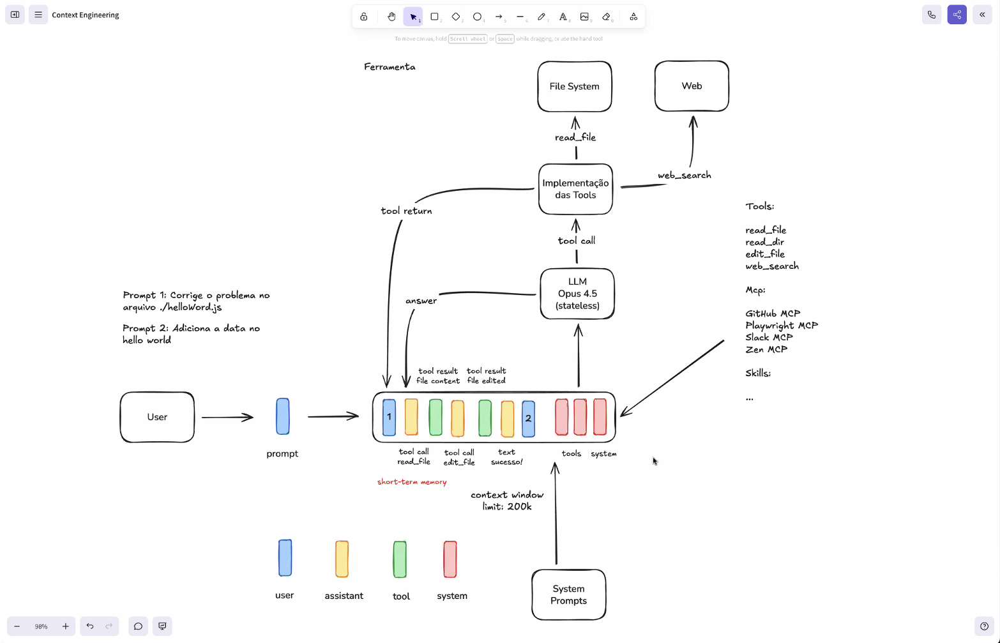

- open router -> https://openrouter.ai/ -> oque é open router: OpenRouter é uma plataforma que permite aos desenvolvedores acessar e integrar modelos de linguagem avançados em suas aplicações. Ele oferece uma interface fácil de usar para interagir com esses modelos, facilitando a criação de soluções baseadas em IA.
  - 

