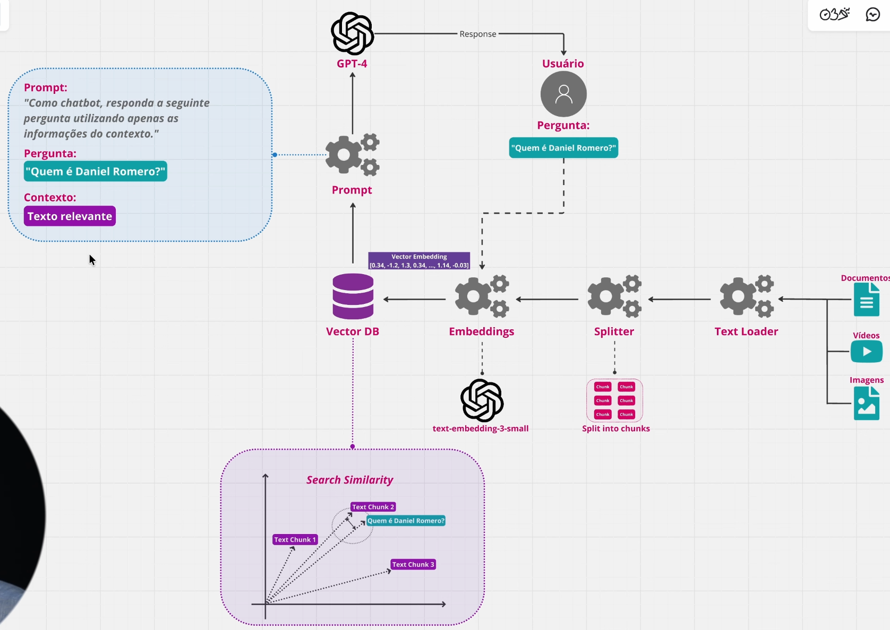

# Fundamentos de RAG (Retrieval-Augmented Generation)

RAG combina a capacidade de recuperação de informações com a geração de texto para criar respostas mais precisas e contextualizadas.

## Componentes Principais

### 1. Recuperação (Retrieval)
- Processo de buscar informações relevantes em uma base de dados ou corpus.
- Utiliza técnicas como busca por similaridade semântica ou indexação.

### 2. Geração (Generation)
- Utiliza um modelo de linguagem para gerar respostas com base nas informações recuperadas.
- O modelo é treinado para entender o contexto e produzir respostas coerentes.

## Como Funciona

1. **Entrada do Usuário**: O usuário faz uma pergunta ou fornece uma entrada.
2. **Recuperação**: O sistema busca informações relevantes no corpus.
3. **Geração**: O modelo gera uma resposta combinando a entrada do usuário com as informações recuperadas.

## Vantagens

- **Precisão**: Respostas baseadas em dados reais e atualizados.
- **Contextualização**: Capacidade de entender o contexto da pergunta.
- **Flexibilidade**: Pode ser aplicado a diferentes domínios e tipos de dados.


## Visualização do Processo



*Figura: Diagrama ilustrando o processo de Recuperação e Geração em RAG. Aula dev mais eficiente AI*


## Exemplos Práticos

### Chatbots
RAG pode ser usado para criar chatbots que respondem com base em documentos específicos, como políticas da empresa ou manuais técnicos.

### Assistentes Virtuais
Assistentes virtuais podem usar RAG para fornecer respostas mais precisas ao consultar bases de conhecimento específicas.

### Pesquisa Acadêmica
RAG pode ajudar na pesquisa acadêmica ao recuperar e sintetizar informações relevantes de artigos e documentos científicos.

### Extração de Informações

As empresas possuem dados não estruturados em grande quantidade, como e-mails, relatórios e documentos. RAG pode ser usado para extrair informações relevantes desses dados, facilitando a tomada de decisões.

### Docling

no diretorio example-docling.

## Chunks, Tokenizers e Modelos de Embedding

### Por que precisamos de Chunks?

Ao processar documentos em RAG, não passamos o documento inteiro para o LLM. Dividimos em pedaços menores chamados **chunks** por várias razões:

#### Problemas com documento inteiro:
- **Contexto poluído**: Muita informação irrelevante dificulta o LLM gerar boas respostas
- **Alto custo**: LLMs cobram por token. Um documento inteiro usa muitos tokens desnecessários
- **Imprecisão na busca**: Não conseguimos identificar qual parte do documento é realmente relevante
- **Limite de tokens**: LLMs têm limites máximos (ex: 4k, 8k, 128k tokens). Um documento grande pode exceder

#### Vantagens dos chunks:
- ✅ Recupera apenas informações **relevantes** para a pergunta
- ✅ Contexto **focado e limpo** para o LLM processar
- ✅ **Economiza tokens** e reduz custos
- ✅ Mantém **metadados** (página, seção, cabeçalhos)

**Exemplo prático:**
```
Pergunta: "Como funciona o algoritmo X?"

❌ Sem chunking: passa 50KB do documento inteiro ao LLM
✅ Com chunking: passa apenas 2-3 chunks (300 tokens) contendo o algoritmo X
```

### O que é o Tokenizer?

Um **tokenizer** é um programa que divide texto em unidades menores chamadas **tokens**. Um token pode ser:
- Uma palavra
- Um caractere
- Uma subpalavra
- Um símbolo

**Exemplo:**
```
Texto: "Machine Learning é importante"

Pode resultar em tokens como:
["Machine", "Learning", "é", "importante"]
```

### O que são Modelos de Embedding e Tokenização?

Diferentes modelos de IA dividem o texto de formas **diferentes**:

```
Texto: "Machine Learning"

Modelo A (all-MiniLM-L6-v2):
→ ["Machine", "Learning"] (2 tokens)

Modelo B (outro tokenizer):
→ ["Mach", "ine", "Learn", "ing"] (4 tokens)
```

#### Por que importa?

Se você chunka um documento com um tokenizer diferente do modelo que vai usar depois, cria **incompatibilidades**:

- Um chunk que tem "300 tokens" segundo Tokenizer A pode ter "400 tokens" segundo Tokenizer B
- O modelo pode não conseguir processar chunks que excedem seu limite
- Há perda de contexto ou fragmentação incorreta

#### Garantindo Consistência:

No código do exemplo (`4-hybrid-chunker.py`):

```python
EMBED_MODEL = "sentence-transformers/all-MiniLM-L6-v2"

tokenizer = HuggingFaceTokenizer(
    tokenizer=AutoTokenizer.from_pretrained(EMBED_MODEL),
    max_tokens=MAX_TOKENS  # 300 tokens
)

chunker = HybridChunker(tokenizer=tokenizer, max_tokens=MAX_TOKENS)
```

O processo é:
1. **Escolher o modelo** que será usado para embeddings (busca semântica): `all-MiniLM-L6-v2`
2. **Usar o tokenizer desse modelo** para chunkar o documento
3. **Respeitar o limite de tokens** do modelo (300 neste caso)
4. Garantir que chunks estejam **otimizados para aquele modelo específico**

Isso assegura que quando você buscar informações (embeddings), os chunks têm o tamanho correto e as informações estão bem estruturadas.


