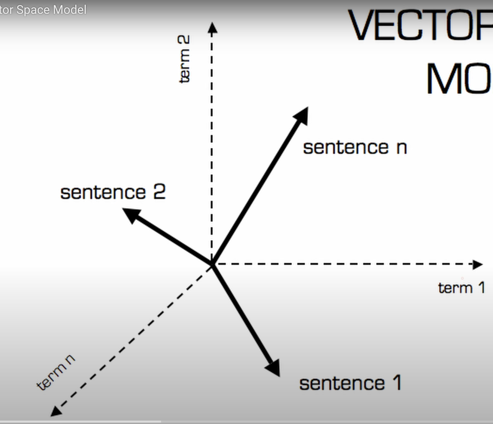
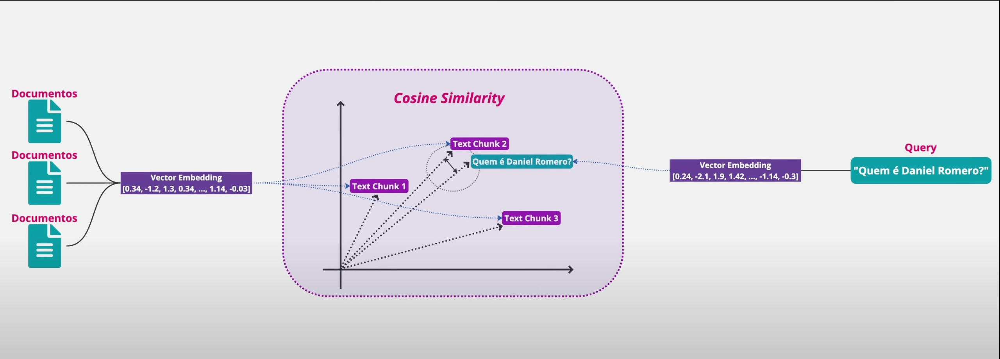

# Retrievel System

## Information Retrieval

Encontrar informações relavantes dentro de grandes volumes de dados, apartir de uma query de usuário. Magica por traz de Searchs engines

### componetes

- Indexing
- Querying
- Ranking

### processo passo a passo

- Data collection -> coleta de dados
- Pre processing -> limpeza e preparados, remover ruido, dividir em chunks (chunks são unidades de texto que são usadas para representar partes do documento).
- Indexing -> documento quebrado em termos
- Querying -> busca de termos
- Ranking -> ordenar resultados por relevancia
- Retrieval -> retornar resultados ao usuario.
  - 

## Tokenization

Processo de dividir o texto em unidades menores, chamadas tokens. Tokens podem ser palavras, frases ou caracteres.

### tecnicas de tokenization

- Word Tokenization -> dividir por palavras
- Sentence Tokenization -> dividir por frases
- Subword Tokenization -> dividir em subpalavras (usado em modelos de linguagem)
- Character Tokenization -> dividir em caracteres individuais

#### ferramentas

- NLTK

### Observações

```
A escolha entre tokenização por sentença ou por palavra servem para momentos diferentes do processamento de texto.


A tokenização por sentença faz sentido quando você precisa manter o contexto completo de uma ideia, como quando está dividindo documentos grandes em chunks para RAG.


Já a tokenização por palavra é mais usada quando você precisa trabalhar com termos individuais, como criar índices de busca ou remover palavras irrelevantes.


A análise semântica moderna funciona nos dois níveis. Você pode gerar embeddings tanto de sentenças completas quanto de palavras individuais. Na prática, muitos sistemas usam os dois tipos em etapas diferentes do processamento. Então a escolha depende mais do que você vai fazer com os tokens depois, e não necessariamente se a análise é semântica ou não.
```

## OpenAI Tokinizer

- ferramenta gratuita para contar tokens em textos.
- https://platform.openai.com/tokenizer
- tokens ID, não possuem significado semântico.

Obs: a palavra computadores, foi dividida em 2 tokens: "computa" e "dores" -> isso acontece porque o BPE(Byte Pair Encoding) quebra palavras em subunidades frequentes para otimizar a representação. Provavelmente "computa" e "dores" são subunidades mais comuns no vocabulário do modelo.

## Retrieval Systems

### Tipos

- Boolean Retrieval -> busca por palavras chave, usa operadores booleanos (AND, OR, NOT). 
  - Exemplo: busca ```samsung AND smartphone AND < $1000```
  - Ve exatamente o que o usuario digitou.
  - usamos quando temos requisitos exatos.

- Vector Space Model -> representa documentos e queries como vetores em um espaço multidimensional
  - Exemplo de busca ```smartphone com boa camera```
  - ajuda encontrar documentos similares baseado na semantica (semantica é a representação de significado).
  - Contras: pode ser computacionalmente intensivo.
  - usamos quando temos requisitos semanticos mais complexos, aberto a novas ideias.

- Probabilistic Retrieval -> usa modelos estatísticos para estimar a relevância dos documentos.
  - Exemplo: busca ```melhores smartphones para fotografia```
  - Contras: requer grandes quantidades de dados para treinar modelos precisos.
  - usamos quando temos grandes volumes de dados e queremos melhorar a relevancia com base em comportamento passado.

## Vector space model

TF-IDF (Term Frequency-Inverse Document Frequency)
- mede a importância de uma palavra(term) em um documento relativo a um corpus.
- documentos e querys são representados como vetores em um espaço multidimensional.
- definições:
  - dimensão: cada termo único no corpus.
  - term/termos: palavra ou frase específica.
  - corpus: conjunto de documentos.
  - documentos: unidades individuais de texto no corpus.

### imagem ilustrativa
    

### Exemplo ludico

Considere um corpus com 3 documentos:
- Doc1: "o gato está no telhado"
- Doc2: "o cachorro está no quintal"
- Doc3: "o gato e  o cachorro são amigos"

E uma query: "gato amigo"

- Dimensões (termos únicos no corpus):
  - "o", "gato", "está", "no", "telhado", "cachorro", "quintal", "e", "são", "amigos"


### Terms e Dimensões
Cada palavra unica no corpus é uma dimensão no espaço vetorial. Isso significa que cada termo único no corpus se torna uma dimensão no espaço vetorial.


### Vetores

- cada documento é representado como um vetor, onde cada componente corresponde ao peso do termo naquela dimensão.
- Query também é representada como um vetor.
- cada termo é um componente do vetor.

### Exemplo Ludico Vetores
- Doc1: [1, 1, 1, 1, 1, 0, 0, 0, 0, 0]
- Doc2: [1, 0, 1, 1, 0, 1, 1, 0, 0, 0]
- Doc3: [1, 1, 0, 0, 0, 1, 0, 1, 1, 1]
- Query: [0, 1, 0, 0, 0, 0, 0, 1, 0, 0]

Cada componente do vetor representa a presença (1) ou ausência (0) do termo correspondente no documento ou query.
cada posição no vetor corresponde a um termo específico na ordem definida anteriormente. Exemplo, a segunda posição corresponde ao termo "gato", a sexta posição ao termo "cachorro", e assim por diante.

### Similaridade
- Similaridade entre documentos e query é medida usando cosseno do ângulo entre os vetores.
- Quanto menor o ângulo, maior a similaridade.

#### Exemplo 

- pega os documentos e cria vetores
- pega a query e cria vetor
- calcula o cosseno do ângulo entre a query e cada documento

imagem ilustrativa


### Formulas

Frequência de Termos (TF)
TF(t,d) = número de vezes que o termo t aparece no documento d / número total de termos no documento d

Mede relevância do termo dentro do documento.
IDF(t, D) = log (número total de documentos no corpus D / número de documentos em D que contêm o termo t)


TF-IDF(t, d, D) = TF(t, d) * IDF(t, D)

#### Exemplo ludico TF-IDF

Considere o termo "gato" no Doc1:
- TF("gato", Doc1) = 1/5 = 0.2
- IDF("gato", Corpus) = log(3/2) ≈ 0.176
- TF-IDF("gato", Doc1, Corpus) = 0.2 * 0.176 ≈ 0.0352

#### Observações

Stop Words (palavras comuns como "o", "e", "de") geralmente são removidas antes do cálculo de TF-IDF, pois não carregam significado relevante.

### Exemplo prático em Python 
no arquivo tokenization-02.py

## Boolean Retrieval

no arquivo tokenization-03.py
